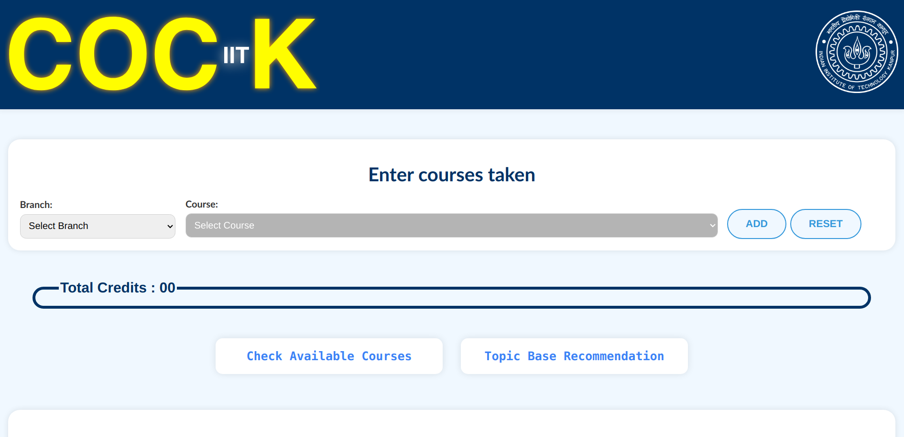
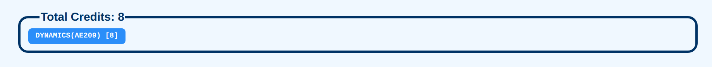
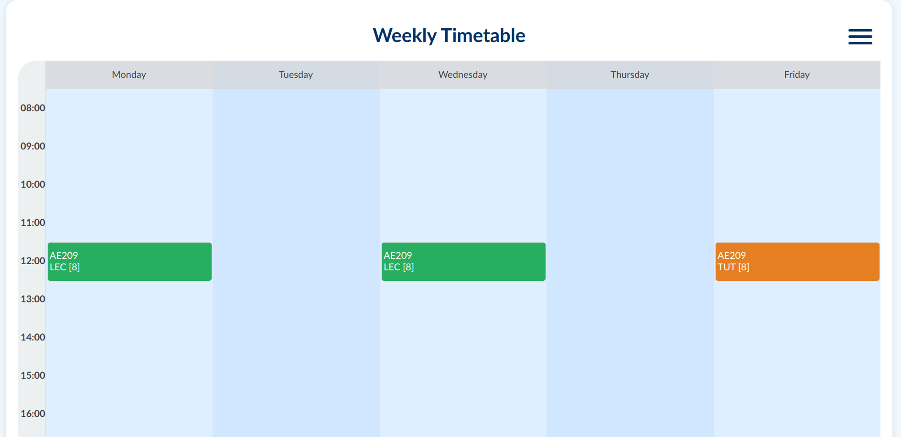
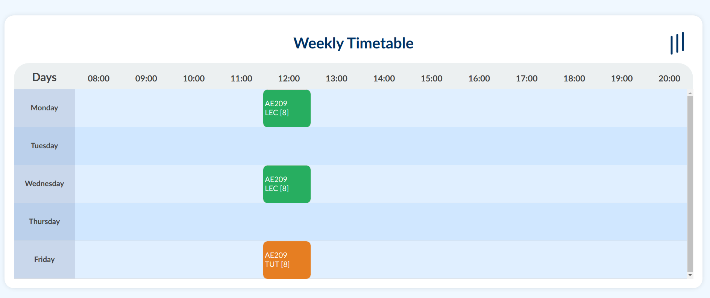
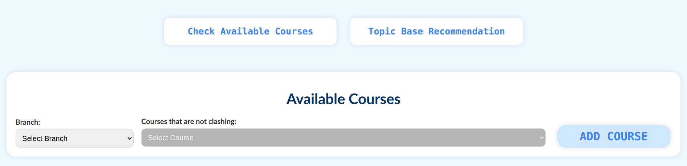

# FRONT_END Folder Overview

Welcome to the **FRONT_END** folder of our project! This folder contains all the essential files for building the frontend of the application. Below is a breakdown of the folder structure, including the purpose and role of each file, along with some visuals to give you a sneak peek of what the application looks like in action!

## 📂 Files & Directories

### `index.html`
This is the main HTML file and the entry point for the entire web application. It defines the structure and content of the page, serving as the backbone of our project.

### `styles.css`
The CSS file responsible for the aesthetics of the webpage. It holds all the styling rules that make the application visually appealing, ensuring a smooth and beautiful user experience.

### `scripts.js`
This JavaScript file powers the logic and interactivity on the frontend. From handling dynamic content to enabling user interactions, it's where the functionality comes alive.

### `(OTHER_OBJECTS)`
This directory is dedicated to various assets like images, icons, and other media files. It's structured to keep the core HTML, CSS, and JavaScript files separate from these resources, ensuring better organization.

---

## 🌟 Landing Page Sneak Peek

  

This is the initial landing page, welcoming users with a sleek design. As you can see, it prioritizes a **dark mode** aesthetic for user comfort.

---

## 📊 Credits Tracker

  

The above screen shows the **total credits** taken by the user, along with functionality to easily remove a course. It's designed for seamless course management.

---

## 🔄 Weekly Timetable Animations

Check out the two different animations available for viewing the weekly timetable. These animations are intuitive and allow for easy navigation through the week.

  

  

---

## 📚 Available Courses Dialog Box

Need to check out the available courses? The user-friendly dialog box below lets users browse through courses with ease.

  

---

### 🚀 What’s Next?

Feel free to explore the repository and dive into the code! Whether you’re here to contribute, explore, or learn, we hope this project inspires you.

If you have any questions or suggestions, don’t hesitate to open an issue or contact us. Happy coding!
